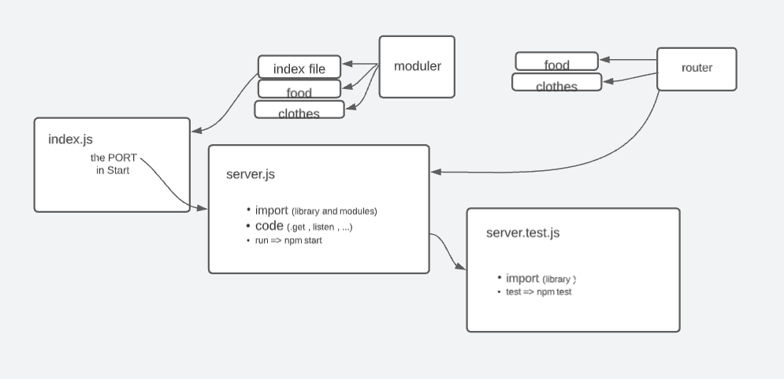

# basic-api-server

## lap 03

[github](https://github.com/mr-atta/basic-express-server)

### run the code by using _npm start || nodemon_

### test the code by using _npm test || on the github_

### finish time : 8:08 pm

